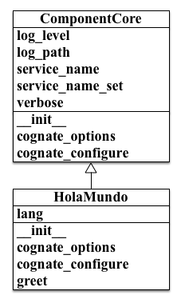
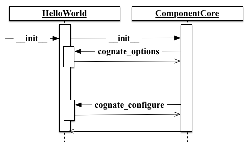

.. _getting-started-with-cognate:

=============================
Getting Started with Cognate
=============================

.. contents::

Welcome to **Cognate**, a package designed with making it easy to create
component services. **Cognate** strives to ease the burden of configuration
management and logging configuration, by providing the infrastructure.
**Cognate** fosters component service architectures by making the design,
implementation, and testing of services less of a chore.

To get up and running the following topics will be covered:

    - :ref:`configuration_management_and_initialization`

    - :ref:`logging_and_log_configuration`

    - :ref:`dynamic_service_naming`

The intent is for *ComponentCore* to make your life easier in the implementation
of stand alone applications. The hope is to take some common service
requirements and make the expression of those requirements trivial.

To begin, an example implementation of

.. _hola_mundo_class:

Hola Mundo Example Class
=========================

.. code-block:: python
    :linenos:

    import sys
    from cognate.component_core import ComponentCore

    class HolaMundo(ComponentCore):
        salutation_map = {
            'Basque': u'Kaixo',
            'Chinese': u"Nǐ hǎo",
            'English': u'Hello',
            'French': u'Bonjour',
            'German': u'Hallo',
            'Hindi': u"Namastē",
            'Japanese': u"Kon'nichiwa",
            'Spanish': u'Hola',
        }

        lang_choices = salutation_map.keys()

        def __init__(self, lang='Spanish', **kwargs):
            self.lang = lang

            ComponentCore.__init__(self, **kwargs)

        def cognate_options(self, arg_parser):
            arg_parser.add_argument('-l', '--lang',
                                    default=self.lang,
                                    choices=self.lang_choices,
                                    help='Set the language for the salutation.')

        def cognate_configure(self, args):
            if args.lang not in self.lang_choices:
                msg = '"lang" value of %s not allowed.' % args.lang
                self.log.error(msg)
                raise ValueError(msg)

        def greet(self, name='Mundo'):
            salutation = self.salutation_map[self.lang]
            greeting = salutation + ' ' + name
            self.log.debug('Greeting: %s', greeting)
            return greeting

    if __name__ == '__main__':
        argv = sys.argv
        service = HolaMundo(argv=argv)

        while (True):
            name = raw_input('Enter name (No input exits):')
            if not name:
                break

            greeting = service.greet(name)
            print greeting

This gives the class hierarchy as in the image below.

  ComponentCore Example Hierarchy

The essence of how *ComponentCore* performs it's operations is via the use of
:mod:`cognate.attribute_helper` module to derive configuration of service stack.
The basic call sequence is depicted in the image below.

:meth:`cognate.component_core.ComponentCore.cognate_options` and
:meth:`cognate.component_core.ComponentCore.cognate_configure` methods via the
use of the
:meth:`cognate.component_core.ComponentCore.__invoke_method_on_children__`.
This effectively calls the *cognate_options* and *cognate_configure* methods
on all primary base classes that derive from *ComponentCore*.

.. _configuration_management_and_initialization:

Configuration Management and Initialization
=============================================

*ComponentCore* helps out with configuration management and initialization of
runtime services. it does this by creating a configuration loop. Utilizing the
:ref:`hola_mundo_class` as an example.

.. _command_line_option_construction:

Command Line Option Construction
---------------------------------

*ComponentCore* provides the means for command line construction to inheriting
classes. This is achieved by the ingestion of command line options through
invocation of *configure_option* method on the chain of ancestor classes that
declare the *configuration_option* method.

The net effect is that *ComponentCore* will collect all of the configuration
options in one bundle, and manage them as a unified instance configuration.
This allows for the centralization of common options and the attending code.

For more detail on this feature, be sure to check out
:meth:`~cognate.ComponentCore._execute_configuration`.

.. _logging_and_log_configuration:

Logging and Log Configuration
==============================

*ComponentCore* supports console and file output. In addition *ComponentCore*
supports
the four basic log levels: `debug`,`info`,`warning`,`error`.

The configuration logging options are:

  :arg: --log_level {debug,info,warning,error}

    Set the log level for the log output.

  :arg: --log_path LOG_PATH

    Set the path for log output. The default file created is
    "<log_path>/<service_name>.log". If the path ends with a ".log"
    extension, then the path be a target file.

  :arg: --verbose

    Enable verbose log output to console. Useful for debugging.

*ComponentCore* log configuration takes advantage of the
:ref:`dynamic_service_naming` for log file naming, as well as in log name
output.

For example::

  2012-12-02 03:26:03,030 - <name> - INFO - Logging configured for:
  VentilatorWindmill

The <name> value will be assigned by default to the instance class utilizing
*ComponentCore*, but will be overridden by the use of the '--service_name
<name>' option.

.. _dynamic_service_naming:

Dynamic Service Naming
=======================

*ComponentCore* provides a mechanism to allow for dynamic naming of
progenitor class
service instances. This is achieved through the use of the '--service_name
<name>'
option. When this flag is set *ComponentCore* will set the `self.service_name`
instance to
the designated value. In addition, *ComponentCore* will set the `self.name_set`
flag to `True`.

By default *ComponentCore* will set the name of the instance class.

The assigned name can effect the output log name, as well as name of the log
output. The use of `self.name` may also effect features from other progenitor
classes that take advantage of *ComponentCore* dynamic naming.

Child classes of ComponentCore can access the configured service app name
through
`self.service_name`.
